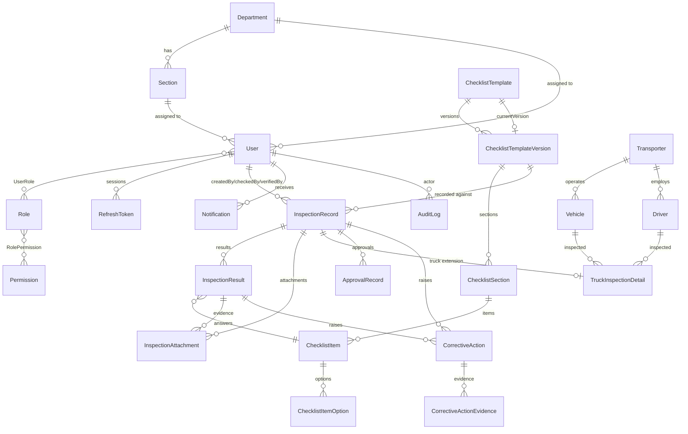

# Database design

> **Production provider:** MongoDB Atlas database `fg_online` (Prisma `provider = "mongodb"`).
> PostgreSQL is **historical only** — see `docs/database/postgresql-migration-archive/` and
> `docs/database/MONGODB_ATLAS_COMPLETE_MIGRATION.md`.

This document describes the domain model behind the Nelna FG Digital
Recording System API (`apps/api`), managed with Prisma.

## Node 24 + Prisma Client loading fix

Prisma Client's default generated output (`node_modules/.prisma/client` +
`node_modules/@prisma/client`) ships a `default.js` entry point that does:

```js
module.exports = { ...require('#main-entry-point') }
```

`#main-entry-point` is a private **package `imports`** subpath, resolved
against the nearest `package.json`. Under pnpm's content-addressable virtual
store (`node_modules/.pnpm/@prisma+client@.../node_modules/`), this
resolution intermittently fails on Node 24 with:

```
TypeError [ERR_PACKAGE_IMPORT_NOT_DEFINED]: Package import specifier
"#main-entry-point" is not defined imported from
.../node_modules/.prisma/client/default.js
```

This reliably reproduced in this repo (confirmed by wiring `PrismaModule`
back into `AppModule` and running `node dist/main.js`) and is why
`PrismaModule` had been removed from `AppModule` to keep `/health` working.

**Fix applied:** generate the client to a single self-contained folder
instead of the default two-package split, and import it directly by relative
path instead of from `@prisma/client`:

```prisma
// apps/api/prisma/schema.prisma
generator client {
  provider   = "prisma-client-js"
  output     = "../generated/prisma-client"
  engineType = "library"
}
```

```ts
// apps/api/src/prisma/prisma.service.ts
import { PrismaClient } from "../../generated/prisma-client";
```

With a custom `output`, the generated client is one folder with its own
`index.js`/`package.json` — there is no cross-package `#main-entry-point`
indirection to break. This is also Prisma's own current recommendation for
monorepos using pnpm. `apps/api/generated/` is build output and is
git-ignored; run `pnpm --filter @nelna/api prisma:generate` after installing
dependencies (the root `build` script already does this before `nest build`).

Verified: `pnpm --filter @nelna/api build && pnpm --filter @nelna/api start`
boots Nest with `PrismaModule` imported, and `GET /health` responds
successfully (reporting `checks.db` as `"down"` when MongoDB is
unreachable, rather than crashing the process).

> **Note for Windows/OneDrive-synced checkouts:** if `prisma generate` fails
> with `EPERM: operation not permitted, rename ... query_engine-windows.dll.node`,
> something (AV/indexing/a previous Nest process that loaded the engine) is
> holding a lock on the existing engine file. Stop any running API process,
> delete/rename `apps/api/generated/prisma-client/query_engine-windows.dll.node`,
> then re-run `prisma generate`.

## Entity-relationship overview



## Domain model

### Identity

| Model | Purpose |
| --- | --- |
| `User` | Employee/system account. `passwordHash` (bcrypt), `status` (`UserStatus`), optional department/section assignment. |
| `Role` / `Permission` / `UserRole` / `RolePermission` | Classic RBAC join model. Seeded from `USER_ROLES` in `@nelna/shared` (FG Operator, FG Supervisor, QA Executive, Food Safety Team Leader, System Administrator, Auditor). |
| `RefreshToken` | Rotating refresh-token session storage for JWT auth (later phase). |

### Organization

| Model | Purpose |
| --- | --- |
| `Department` / `Section` | Simple two-level org unit hierarchy (e.g. Finished Goods → FG Store, Changing Room, Dispatch). |
| `Shift` | Morning / Afternoon / Night, with start/end times. |

### Checklist management (versioned)

`ChecklistTemplate` is the stable, addressable definition (`code`, e.g.
`NMS/PPU/CL/24`). All actual content — sections and items — lives on
`ChecklistTemplateVersion`, so historical records stay interpretable even as
templates evolve:

- `@@unique([templateId, versionNumber])` prevents duplicate version numbers
  per template.
- `ChecklistTemplate.currentVersionId` points at the version operators should
  fill in today; older versions are kept, never deleted.
- **Published versions are treated as immutable at the application layer**:
  `seed.ts` refuses to re-create sections/items for a template whose current
  version is already `PUBLISHED`, and any future "edit template" API should
  create a **new** `ChecklistTemplateVersion` rather than mutating a
  published one's sections/items.
- `InspectionRecord.templateVersionId` is a required, `Restrict`-on-delete
  foreign key to the exact version — a record's shape is always
  reconstructable from the version it references, regardless of later
  template changes.
- `ChecklistItemOption` is an optional, per-item preset list (e.g. a
  dropdown of standard failure reasons); not required for the basic
  Acceptable/Unacceptable/N/A flow.

### Operational records

- `InspectionRecord` is the generic "one completed checklist submission"
  aggregate — used for both Daily Cleaning Verification and Freezer Truck
  Inspection records (the specific checklist shape comes from whichever
  `ChecklistTemplateVersion` it references).
- `InspectionResult` is one answer per `ChecklistItem` (`@@unique([recordId, itemId])`),
  carrying `status` (`ResultStatus`), and — required at the application layer
  when a result fails — `issueReason`, `correction`, `correctiveAction`.
- `InspectionAttachment` stores evidence photos/files, optionally scoped to a
  specific `InspectionResult` (failed-item evidence) or just the record.
- **Soft lifecycle only**: `InspectionRecord.status` (`RecordStatus`:
  `DRAFT → SUBMITTED → CHECKED → VERIFIED`, or `REJECTED`/`ARCHIVED`) plus
  `archivedAt` model the record's lifecycle. There is no cascading delete
  path from any master-data table down onto `InspectionRecord` rows, and the
  API layer must never issue a hard `DELETE` against a `VERIFIED` record —
  only `ARCHIVED` transitions are permitted once verified.
- `ResultStatus` is a single enum (`ACCEPTABLE`, `UNACCEPTABLE`,
  `NOT_APPLICABLE`, `PASS`, `FAIL`) shared by both cleaning-style
  (Acceptable/Unacceptable/N/A) and truck-style (Pass/Fail/N/A) checklists,
  so `InspectionResult` stays generic. Which subset is meaningful for a given
  item is a UI/seed-time concern, not a DB constraint.

### Truck

`Transporter` → `Vehicle` / `Driver` are master data. `TruckInspectionDetail`
is a 1:1 extension of `InspectionRecord` (`@@unique([recordId])`) carrying the
truck-specific fields (freezer truck number, vehicle number, temperature,
final `loadingDecision`) for Freezer Truck Inspection records (`NMS/PPU/CL/30`).

### Workflow

- `ApprovalRecord` — a generic decision log per record (check / verify /
  loading decision / corrective-action verification / template publish),
  decoupled from the specific `checkedBy`/`verifiedBy` convenience columns on
  `InspectionRecord` so multiple approval types can be tracked per record.
- `CorrectiveAction` / `CorrectiveActionEvidence` — issue tracking that can be
  raised from a record or a specific failed result, assigned to a user, with
  `status` (`CorrectiveActionStatus`) and `priority` (`Priority`).

### System

- `Notification` — in-app notifications per user.
- `AuditLog` — actor + action + entity + JSON metadata, unchanged in shape
  from Phase 1.

## Cascade / delete strategy

Per the task brief, cascades are deliberately conservative:

- **`Cascade`** is only used within a single aggregate's own ownership chain,
  where the child row has no meaning without its parent and the parent is
  either never expected to be deleted in practice, or its deletion is an
  explicit, intentional admin action that should also clear its own children:
  `ChecklistTemplateVersion → ChecklistSection → ChecklistItem → ChecklistItemOption`,
  `InspectionRecord → InspectionResult`, `InspectionRecord/InspectionResult → InspectionAttachment`,
  `CorrectiveAction → CorrectiveActionEvidence`, `User → UserRole/RefreshToken/Notification`,
  `Role → RolePermission`, `InspectionRecord → TruckInspectionDetail`.
- **`Restrict`** protects historical/master-data references that must never
  silently disappear: `ChecklistTemplateVersion → ChecklistTemplate`,
  `InspectionRecord → ChecklistTemplateVersion`, `InspectionResult → ChecklistItem`,
  `Section → Department`, `UserRole → Role`, `RolePermission → Permission`,
  and every "who did this" `createdBy` reference on records/corrective
  actions/attachments.
- **`SetNull`** is used for optional, non-defining references where losing
  the link is acceptable and shouldn't block deleting the referenced row:
  `checkedBy`/`verifiedBy`/`decidedBy`/`assignedTo` user references, `Vehicle`/`Driver`/`Transporter`
  links, `User.department`/`section`, `CorrectiveAction.record`/`result`.

No foreign key in this schema cascades across more than one aggregate
boundary, so deleting any single row can never silently wipe out unrelated
operational history.

## Schema sync (MongoDB)

Prisma Migrate is **not** used for MongoDB. Historical PostgreSQL SQL migrations
live under `docs/database/postgresql-migration-archive/` for reference only.

```bash
pnpm --filter @nelna/api prisma:generate
pnpm --filter @nelna/api prisma:validate
pnpm --filter @nelna/api prisma:push
pnpm --filter @nelna/api prisma:seed
```

Production target database name: **`fg_online`**. Automated tests use **`fg_online_test`** only.

## Local / CI test MongoDB

```bash
docker compose -f docker-compose.test.yml up -d
# DATABASE_URL → mongodb://127.0.0.1:27017/fg_online_test?...
pnpm --filter @nelna/api prisma:push
pnpm --filter @nelna/api prisma:seed
```

For Atlas development, copy `apps/api/.env.example` → `apps/api/.env` and set a
real `DATABASE_URL` targeting `fg_online` (never commit `.env`).

## Seed data

`apps/api/prisma/seed.ts` (idempotent — safe to re-run) seeds, via
`apps/api/prisma/seed-data.ts`:

1. **Permissions** — a fixed list of permission keys (`records:create`, `templates:publish`, etc).
2. **Roles** — one per `UserRole` in `@nelna/shared`, each wired to a sane
   default permission set via `RolePermission`.
3. **Organization** — a Finished Goods department with FG Store / Changing
   Room / Dispatch sections, and Morning/Afternoon/Night shifts.
4. **Checklist templates** — `NMS/PPU/CL/24` (Daily Cleaning Verification:
   Finished Goods + Changing Room sections, items sourced from
   `@nelna/shared`'s `FG_CLEANING_ITEMS`/`CHANGING_ROOM_CLEANING_ITEMS`) and
   `NMS/PPU/CL/30` (Freezer Truck Inspection Before Loading, items from
   `FREEZER_TRUCK_CHECK_ITEMS`), each seeded as a single `PUBLISHED` version 1.
   Re-running the seed is a no-op for a template once its current version is
   published, so published versions stay stable.
5. **Sample users** — **only** created when both `SEED_<ROLE>_EMAIL` and
   `SEED_<ROLE>_PASSWORD` env vars are set (see `apps/api/.env.example`);
   passwords are hashed with bcrypt before storage. No credentials are
   hard-coded in the seed script.

Run it with `pnpm --filter @nelna/api exec prisma db seed` (wired via the
`prisma.seed` field in `apps/api/package.json`).
